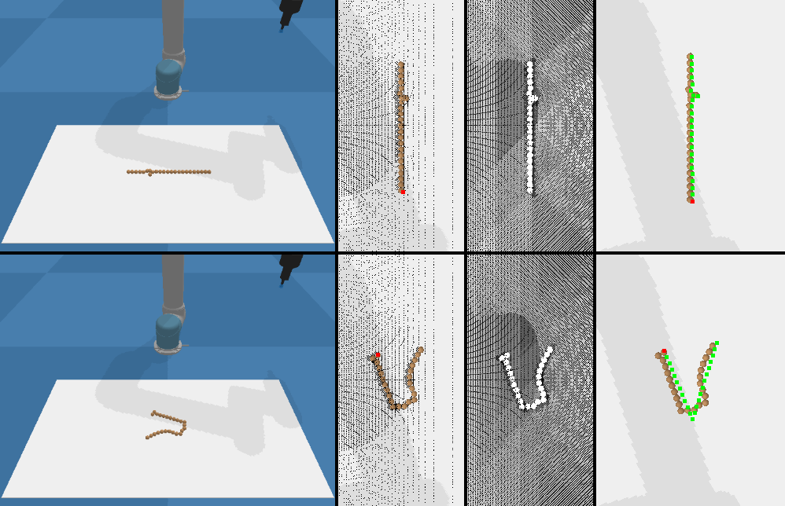

# Learning visual-based deformable object rearrangement with local graph neural networks

This repository is the code of the paper "Learning visual-based deformable object rearrangement with local graph neural networks", published in Complex & Intelligent SystemsL.

If you find this code useful in your research, please consider citing:

~~~
@article{deng2023learning,
  title={Learning visual-based deformable object rearrangement with local graph neural networks},
  author={Deng, Yuhong and Wang, Xueqian and Chen, Lipeng},
  journal={Complex \& Intelligent Systems},
  pages={1--14},
  year={2023},
  publisher={Springer}
}
~~~

## Table of Contents
* [Installation](#Installation)
* [Generate Data](#Generate-Data)
* [Train Model](#Train-Model)
* [Evaluate Model](#Evaluate-Model)

## Installation
This simulation environment is based on pybullet. You can follow the instructions in [DeformableRavens](https://github.com/DanielTakeshi/deformable-ravens) to setup the simulator.

1. Clone this repository.

2. Install the following packages in the created conda environment:

    * pytorch and torchvision: `
    * tensorflow:
    * tensorflow_addons 
    * pybullet:
    * torch_geometric

## Generate Data
* Run the following script to generate demonstrations for model training:

  ~~~
  python collect.py -eposide_num 1100 -task_type "rope_line"
  ~~~

  where `-task_type` specifies the deformable object rearrangement task type (rope_line|rope_l|rope_v|rope_n|ring_circle|ring_square|ring_move|cloth_fold|cloth_flatten|cloth_fold_a)

  
   
## Train Model

* Train Model:

  ```
  python main.py --mode train -task_type "rope_line"
  ```

  ```
  python main_multi.py --mode train 
  ```
  
  where `main.py` represent single task learning fashion, `main_multi.py`represent multi-task learning fashion

## Evaluate Model

* Evaluate Model:

  ```
  python main.py --mode test -task_type "rope_line"
  ```

  ```
  python main_multi.py --mode test
  ```  
